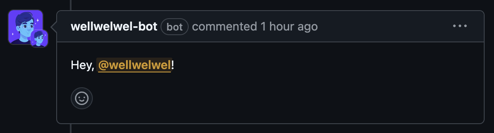

# 🌀 wellwelwel [bot]

> 🚧 **WIP**.

Create a personal **GitHub Action** + free server to dispatch a bot to comment on external contributions _(forks)_.

Feel free to fork it and create your own bot _(see bellow)_ ✨

---

## 🕹️ Usage

### Commenting directly from the workflow

```yml
name: Testing
on:
  pull_request:
  workflow_dispatch:
jobs:
  test-bot:
    runs-on: ubuntu-latest
    steps:
      - name: wellwelwel-bot
        uses: wellwelwel/bot@v1.0.0
        with:
          update-if-includes: '<!-- BOT-COMMENT -->'
          comment: 'Hey, @user! <!-- BOT-COMMENT -->'
```

### Commenting using a markdown file

```yml
- name: wellwelwel-bot
  uses: wellwelwel/bot@v1
  with:
    update-if-includes: '<!-- BOT-COMMENT-FILE -->'
    comment-from-file: './fixtures/comment-file.md'
```

[**./fixtures/comment-file.md**](./fixtures/comment-file.md):

```md
Hey, @user _(from a file)_! <!-- BOT-COMMENT-FILE -->
```

> [!TIP]
>
> - If you text `@user`, it will be replaced by the current user that opened the Pull Request.
> - Continue to the documentation to learn how to create your own Action.

---

## 💡 Motivation

Previously using [**peter-evans/create-or-update-comment@v4**](https://github.com/peter-evans/create-or-update-comment) to automate reports, unfortunately, the **GITHUB_TOKEN** has significant limitations, especially when it comes to forks.

Also, using `pull_request_target` isn't a safe practice, since it can allow others to use repository secrets directly in their forks.

Creating a bot was the safest way to create automated comments with reports or even welcome you when I'm away in **Issues**, **Pull Requests** and **Discussions**.

---

## 🃏 How to fork it to make it your own

First, Find all the _"wellwelwel"_ in the repository and replace it with your username or that of your organization.

### 🏠 Local server

Install dependencies by running:

```sh
npm ci
```

Create a `.env` for each variable to use your server locally:

```sh
APP_ID=''
PORT=''
WEBHOOK_SECRET=''
```

Then, put your app `.pem` certificate in `./private-key.pem`.

- You can test your server locally using [**ngrok**](https://ngrok.com/) for free.
- Once everything is your way, you can move up the server to the service you want.

Available **npm** scripts:

- `dev` _(TypeScript Watch Mode)_

Finally, set the `WEBHOOK_URL` secret on **GitHub** with your server URL, for example: `https://***.ngrok-free.app/webhook`.

---

### 🛜 Serve — Easy, but Paid (Azure, VPS, EC2, etc.)

Run the commands:

- `build` _(Compile to JavaScript)_
- `serve` _(Serves the Server in Production)_

You can decide whether to use the certificate as a file or using the `PRIVATE_KEY` local variable secret, including the same local variables (secrets) mentioned in the local server step.

Finally, set the `WEBHOOK_URL` secret on **GitHub** with your server URL, for example: `https://***/webhook`.

---

### 🌥️ Wangler (Cloudflare Workers)

First, convert your PKCS#1 private key (generated from **GitHub**) to PKCS#8:

```sh
openssl pkcs8 -topk8 -inform PEM -outform PEM -nocrypt -in private-key.pem -out private-key-pkcs8.pem
```

The private key needs to be tailored to a single line. Let's copy it to clipboard:

```sh
# Unix
awk 'NF {sub(/\r/, ""); printf "%s\\n", $0;}' private-key-pkcs8.pem | pbcopy

# Windows
(Get-Content private-key-pkcs8.pem) -join "`n" | Set-Clipboard
```

Now, we can set the secrets:

```sh
# Press `Enter` and paste the content from the clipboard (previous command)
wrangler secret put PRIVATE_KEY
```

Then continue with the remaining secrets:

```
wrangler secret put APP_ID
wrangler secret put WEBHOOK_SECRET
```

Now in your **Cloudflare** account, you can connect your repository to the **Cloudflare Workers** and use the command `npm run wangler:serve` to serve it for free.

Finally, set the `WEBHOOK_URL` secret on **GitHub** with the Cloudflare URL, for example: `https://bot.***.workers.dev`.

---

### ⚗️ GitHub Actions

Create a **secret** for each variable to use your webhook, once the server has been deployed:

- `WEBHOOK_SECRET`
- `WEBHOOK_URL`

To use versions, you can use Git tags:

```sh
git tag -a v1 -m "feat: create my first app"
git push origin v1
```

---

### 🤖 GitHub App

> [!IMPORTANT]
> When creating your **GitHub App**, make sure you select the option so that only you or your organization can use the app.

In `Repository permissions` you will select:

- Contents (Read-only).
- Discussions (Read and Write)
- Issues (Read and Write)
- Pull requests (Read and Write)

---

### 🔑 Access

Grant your **GitHub App** permission to access the repositories you want. This will allow you to automate comments in any repository that you have allowed the app without any additional keys, including private repositories.

### Last steps

Before creating your first Pull Request in your fork, go to the _"Actions"_ tab of your repository and activate the workflow actions.

Now when you create your first Pull Request within your fork, you'll see a comment similar to this one, but with your own profile avatar:

> 

---

> [!TIP]
> Doing this process while listening to your favorite playlist can make the challenge more interesting 🎧

With love, [**Weslley**](https://github.com/wellwelwel) 💙
